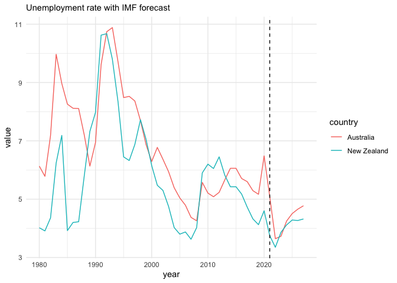

<!-- README.md is generated from README.Rmd. Please edit that file -->

# readweo

<!-- badges: start -->

[](https://lifecycle.r-lib.org/articles/stages.html#experimental)
[](https://github.com/MattCowgill/readweo/actions/workflows/R-CMD-check.yaml)
<!-- badges: end -->

**Note that this package is intended for my own use. It is in an
‘experimental’ phase. I do not plan to submit this to CRAN and I offer
no guarantees that it will continue to work.**

`{readweo}` helps you download, import and tidy data from the IMF’s
World Economic Outlook.

## Installation

You can install `{readweo}` from [GitHub](https://github.com/) with:

``` r
# install.packages("devtools")
devtools::install_github("MattCowgill/readweo")
```

## Usage

The package has one key function: `read_weo()`.

You can use it like so:

``` r
library(readweo)
weo <- read_weo("Oct 2022")
weo
#> # A tibble: 308,014 × 13
#>    weo_count…¹ iso   weo_s…² country subje…³ subje…⁴ units scale count…⁵ estim…⁶
#>    <chr>       <chr> <chr>   <chr>   <chr>   <chr>   <chr> <chr> <chr>     <dbl>
#>  1 512         AFG   NGDP_R  Afghan… Gross … Expres… Nati… Bill… Source…    2020
#>  2 512         AFG   NGDP_R  Afghan… Gross … Expres… Nati… Bill… Source…    2020
#>  3 512         AFG   NGDP_R  Afghan… Gross … Expres… Nati… Bill… Source…    2020
#>  4 512         AFG   NGDP_R  Afghan… Gross … Expres… Nati… Bill… Source…    2020
#>  5 512         AFG   NGDP_R  Afghan… Gross … Expres… Nati… Bill… Source…    2020
#>  6 512         AFG   NGDP_R  Afghan… Gross … Expres… Nati… Bill… Source…    2020
#>  7 512         AFG   NGDP_R  Afghan… Gross … Expres… Nati… Bill… Source…    2020
#>  8 512         AFG   NGDP_R  Afghan… Gross … Expres… Nati… Bill… Source…    2020
#>  9 512         AFG   NGDP_R  Afghan… Gross … Expres… Nati… Bill… Source…    2020
#> 10 512         AFG   NGDP_R  Afghan… Gross … Expres… Nati… Bill… Source…    2020
#> # … with 308,004 more rows, 3 more variables: year <dbl>, value <dbl>,
#> #   weo_date <date>, and abbreviated variable names ¹​weo_country_code,
#> #   ²​weo_subject_code, ³​subject_descriptor, ⁴​subject_notes,
#> #   ⁵​country_series_specific_notes, ⁶​estimates_start_after
```

`read_weo()` returns a tidy (long) tibble.

You can use it like this:

``` r
library(dplyr)
#> 
#> Attaching package: 'dplyr'
#> The following objects are masked from 'package:stats':
#> 
#>     filter, lag
#> The following objects are masked from 'package:base':
#> 
#>     intersect, setdiff, setequal, union
library(ggplot2)
weo %>% 
  filter(country %in% c("New Zealand", "Australia"),
         subject_descriptor == "Unemployment rate") %>% 
  ggplot(aes(x = year, y = value, col = country)) +
  geom_line() +
  geom_vline(aes(xintercept = estimates_start_after),
             linetype = 2) +
  theme_minimal() +
  labs(subtitle = "Unemployment rate with IMF forecast")
```


